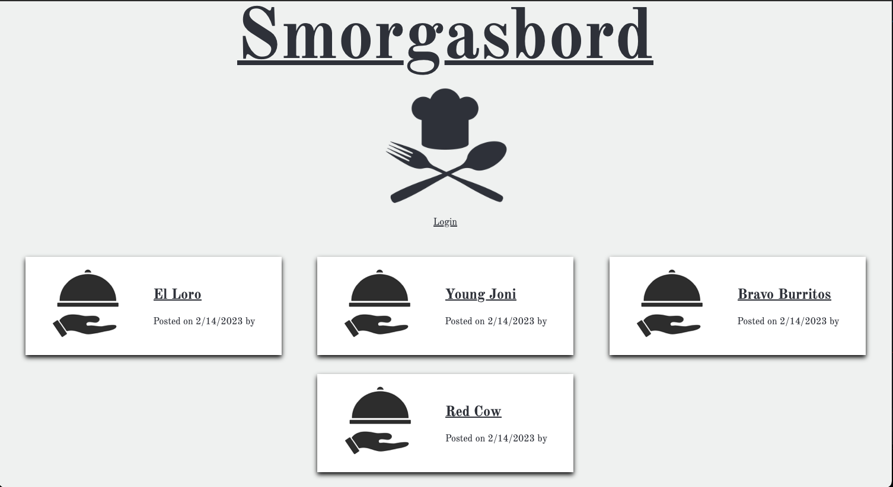
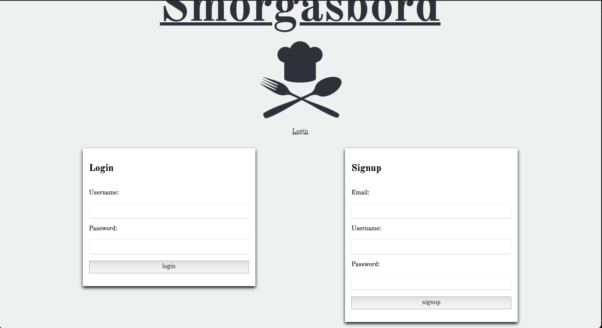
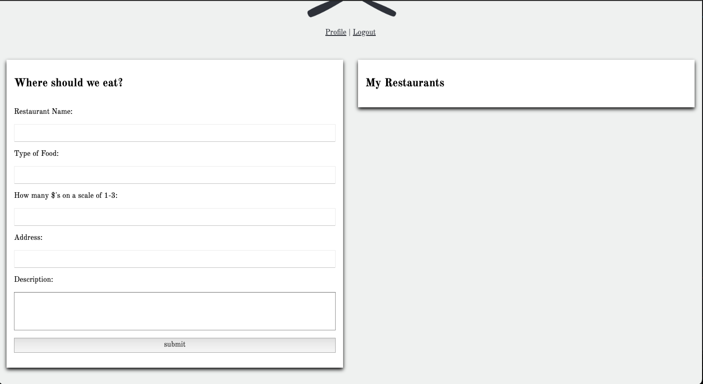

# Smörgåsbord

## Description

Smorgasbord is a website for users to post and view favorite restaraunts. Users can view others restraunts that have been posted, as well as review the postings of others. Each user has a personal profile for easy access to their own favorite restaraunts.

## Installation & Screenshots

The deployment can be copied from the repo at [github](https://github.com/Greg-Trahan/smorgasbord). The website can also be viewed from a launched version on [heroku](https://smorgasbord.herokuapp.com/).

## Build Status

## Tech/Framework/Code

Smorgasbord uses a combination of Javascript, CSS, and HTML to build the website. The use of node.js packages were important throughtout the project. Express, and handlebars were largely implimented as well. A new technology for our team was nodemailer package. This package sends out a confirmation email to those who have signed up for the website.

## How to use?

When a user goes to the depolyed [website]](https://smorgasbord.herokuapp.com/), they will first see the homepage where others have previously posted thier favorite restaraunts. If they want more details on any of the restaurants listed, or if they would like to post thier own reccomendations, they can navidage to the login page, where there will also be a sign-up form. From there the user can post, view, and comment on the entire website.

## Credits

The creators of the website are: - Dani: [danibano](https://github.com/danibano) - Greg: [Greg-Trahan](https://github.com/Greg-Trahan) - Jacob: [OdeToTheCode](https://github.com/OdeToTheCode) - Lon: [lonHeligas](https://github.com/lonHeligas)
